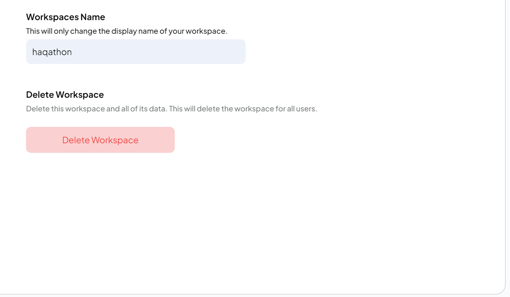
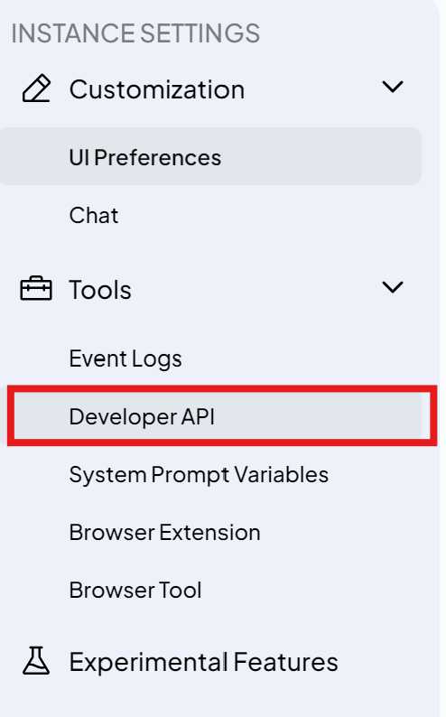
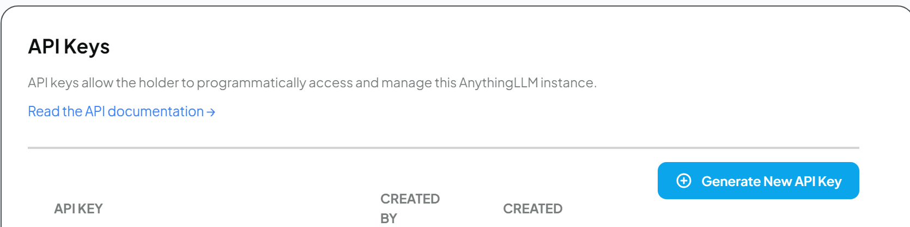
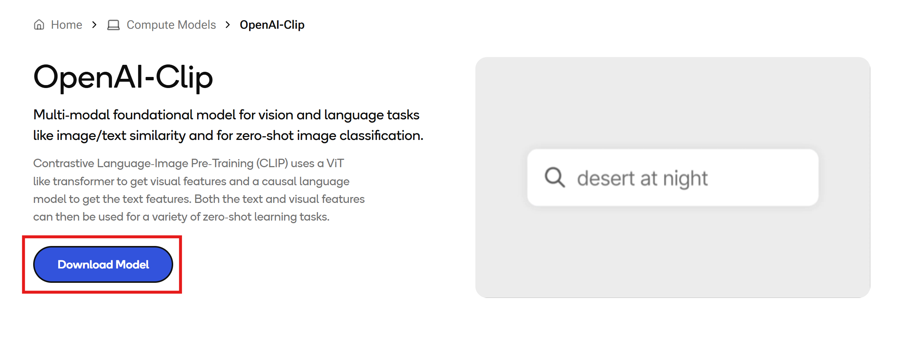
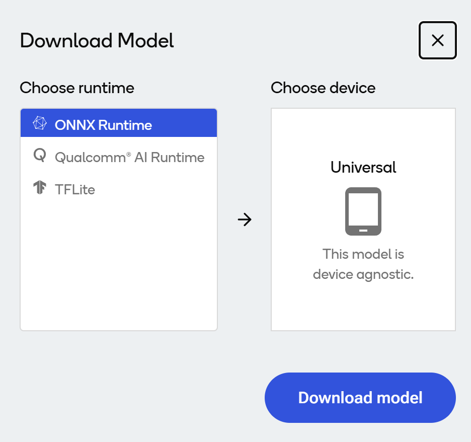

# Focus Assist

A Pomodoro timer with AI-powered focus tracking for Snapdragon X Elite laptops using local NPU processing.

## Features

- ✅ Customizable Pomodoro timer with work/break intervals
- ✅ Task management with progress tracking
- ✅ Clean terminal interface with progress bars
- ✅ Thread-safe architecture for future AI integration

## Installation

Download AnythingLLM: https://anythingllm.com/desktop

Install AnythingLLM and create a new workspace with the name 'HaQathon'

Click on the Gear Icon:


Make Sure it Looks like this:



Go to the settings wrench at the bottom of the screen:


Navigate to the Developer API Under the Tools Tab in the Instance Settings:



Create a new API Key and Copy the Value of the Key:



Update the .env file in src with the api key

```env
API_KEY = <YOUR API KEY HERE>
```

Now Download the Required Model Files From Qualcomm AI Hub:

[OpenAI-Clip Model](https://aihub.qualcomm.com/compute/models/openai_clip?domain=Multimodal&useCase=Image+Classification)

Click on the Download Model Button:



Make sure to download the ONNX Runtime Version




Git Clone the Repo:
```bash
git clone https://github.com/SatvikMatta/HaQathon.git
```

Move the downloaded files into the `src` folder.


Then run the following commands into the Command Prompt:
```bash
cd HaQathon
install.bat
```

That's it installation should be done.


## Usage

To run the program do the following commands from the `HaQathon` Directory:

```bash
cd src
python focus_assist_gui.py
```

## License

Licensed under the terms in the LICENSE file.